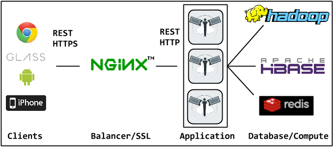

Overview
=========

Capabilities
------------
Below is an concise (and incomplete) list of the "things you can do", more detail is available throughout the documentation.

- Crawling: Flickr
- Annotation: Standalone or Mechanical Turk.  Several operating modes.
- Visualization: Thumbnails, Metadata, Exif, and Location
- Image features
- Classifier Training
- Binary Hash Function Learning
- Search Indexing

How Picarus fits in
---------------------------
Picarus is designed to be used in a variety of capacities from data warehouse, execution engine, web application, REST API, and algorithm factory; however, these are intended to be optional and the level of integration and involvement should be determined by the user.

Data Warehouse
^^^^^^^^^^^^^^
Picarus uses two data models: row access (i.e., table/row) and contiguous row slice access (i.e., table/startRow/stopRow).  Each row contains a columns of values.  Essentially any datastore that can be modeled in this form can be easily integrated in Picarus.  Picarus currently uses HBase as the primary datastore and Redis for metadata.  Picarus can be used effectively as a convenient way to interface with data as it provides a convenient server with authentication, user permissions, and sharing.

Execution Engine
^^^^^^^^^^^^^^^^
Processing occurs either at the web application level or on Hadoop depending on the job submitted.  No state is kept on the Picarus application servers, which allows multiple instances to be run on separate machines behind a load balancer (e.g., nginx, haproxy).  Hadoop is powerful but often difficult for new developers to work with.  Picarus provides a simple interface for Hadoop algorithms.

Algorithm Factory
^^^^^^^^^^^^^^^^^
New classifiers can be trained, search indexes built, and algorithms instantiated.  These can all be composed into fairly complex algorithms and executed using Picarus; however, there is no reason why after the algorithm is trained that it needs to be executed solely by the Picarus environment.  Consequently, we designed the system so that every algorithm can be 'taken out' as a config file and executed by a standalone binary (see the picarus_takeout project for details).  The 'takeout' functionality is implemented in standard C/C++ with as few (and optional) dependencies as possible to enable the broad compatibility.  What that means is that you can use Picarus after algorithm creation for execution or you can extract the algorithms and use them as you wish (e.g., mobile apps, compiled to javascript, offline applications).  

REST API
^^^^^^^^
The API is provided at a RESTful protocol following standard conventions where possible.  Some of the Picarus functionality, such as slice level access, is unique to Picarus and there don't exist common conventions; in these instances we attempted to be consistent and use the 'least surprising' solution.

Web Application
^^^^^^^^^^^^^^^^
The web interface is implemented using Backbone.js as a single page that provides access to Picarus through the same REST api described in this documentation.  The web application is designed to be modular, it is very easy to add a new page for specific funtionality that you may want.

Models
------------------
Picarus abstracts data analysis as a sequence of models with a defined flow from source data through them.  Each model describes how to instantiate it, what inputs it took (either other models or raw source data), what parameters it has, user notes/tags, and permissions (i.e., who can use/modify it).  The result is that given a column name (i.e., data stored for a specific image) we can determine exactly what process of steps occured to create it; moreover, this allows for natural utilization of pre-processed data, re-use of components, and parallel computation.  Models are immutable once created and this is enforced by their row encoding the hash of the model, input, and parameters which allows for verifying that the model has not been modified since its creation.  This is necessary to ensure consistency; moreover, the versions of each underlying module in use are stored in the model so that it is possible to manually determine if an incompatible change has been made which would necessitate reprocessing the data.

Examples of models are preprocessors (i.e., take source data, condition is based on specific rules), features (i.e., take processed image and produce a visual feature), classifiers (i.e., take a feature and produce a confidence value (binary) or a ranked list of classes (multi-class)), hashers (i.e., take feature and produce a binary hash code), and search indexes (i.e., take a binary hash code and produce a ranked result list).  Essentially, an output column in the images table corresponds to a row in the models table.
